# BirdCLEF+ 2026 — Data Analysis Summary

All numbers below come from the **actual local files** (16.1 GB / 46,213 files);
no figures are taken from training data or assumptions. Reproduce with
`python3 analysis/analyze.py`. Raw tables in `analysis/stats/`, figures in
`analysis/plots/`.

## TL;DR — what matters for modeling

1. **234 target classes; only 206 have any `train_audio` clip.** The 28 missing
   are 25 insect *sonotypes* (`47158son01`–`47158son25`) plus 3 others
   (`1491113`, `25073`, `517063`). They are ONLY learnable from
   `train_soundscapes_labels.csv`.
2. **Extreme class imbalance.** 34,799 of 35,549 train clips (≈98%) are birds.
   The single Reptilia class has **1 clip**. Insects average **7 clips/sp**, vs
   **215 clips/sp** for birds.
3. **Severe domain shift.** Only **2.38%** (847 / 35,549) of training clips were
   recorded inside the Pantanal bounding box — the test set is recorded
   entirely inside it. Most train audio is from elsewhere worldwide.
4. **Train clips are long & variable (median 21 s, max 12 min); test rows are
   fixed 5-s windows** of 60-s soundscapes. You must window/segment.
5. **All audio is 32 kHz mono `.ogg`** — no resampling needed.
6. **`train_soundscapes_labels.csv` has every row duplicated** — 1,478 raw rows,
   only **739 unique** segment labels across 66 files. Dedupe before training.
7. **89% of labeled segments are multi-label** (mean 4.2 species, max 10).
   Treat the soundscape head as multi-label classification, not single-label.
8. **10,658 train soundscapes vs 66 labeled** → 99.4% of soundscape audio is
   unlabeled. Strong pseudo-label / SSL target.
9. **Submission columns exactly match `taxonomy.csv`** (234 species) — no header
   mismatches to worry about.

---

## 1. Class & species distribution

### 1.1 Taxonomic breakdown

| Class    | # species (taxonomy) | # train_audio clips | mean clips/sp |
| :------- | -------------------: | ------------------: | ------------: |
| Aves     | 162                  | 34,799              | 214.8         |
| Amphibia | 35                   | 451                 | 12.9          |
| Insecta  | 28                   | 199                 | 7.1           |
| Mammalia | 8                    | 99                  | 12.4          |
| Reptilia | 1                    | 1                   | 1.0           |

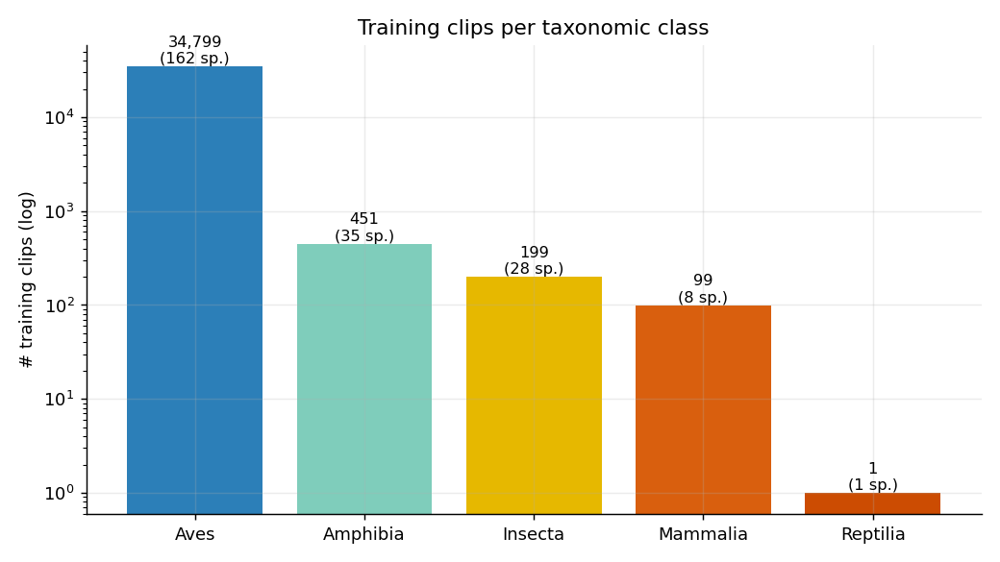

### 1.2 Per-species clip counts (ranked)

206 species have at least one `train_audio` clip; **min = 1, median = 125,
max = 500**.

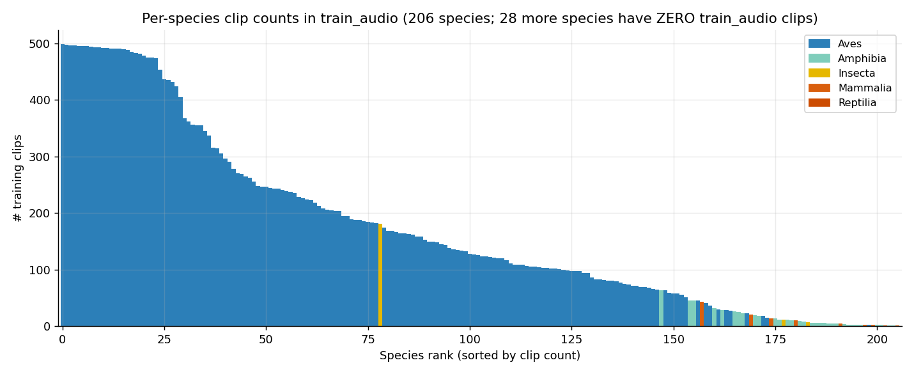
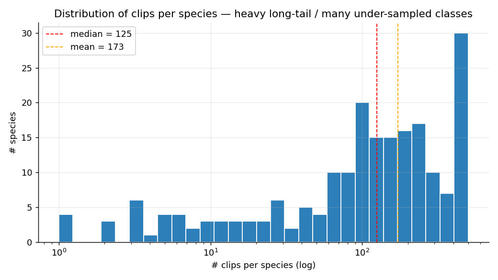

### 1.3 Species with **zero** `train_audio` clips

All 28 species missing from `train_audio` are precisely those that appear in
`train_soundscapes_labels.csv`. Full list in
`stats/species_missing_from_train_audio.csv`. They are dominated by **25 insect
sonotypes** (`47158son01`–`47158son25`) — sound-defined "classes" without
species-level identification — plus 3 other taxa (`1491113`, `25073`, `517063`).

> Implication: any model needs a soundscape-based learning path (multi-label
> on `train_soundscapes_labels.csv`) to cover these 28 classes at all.

### 1.4 Collection source (XC vs iNat)

| class    |  XC | iNat |
| :------- | --: | ---: |
| Amphibia |  58 |  393 |
| Aves     | 22,952 | 11,847 |
| Insecta  |   0 |  199 |
| Mammalia |  33 |   66 |
| Reptilia |   0 |    1 |

All Insecta and Reptilia clips are iNaturalist-only; majority of birds are
xeno-canto. Rating signal exists only for XC clips (see 1.5).

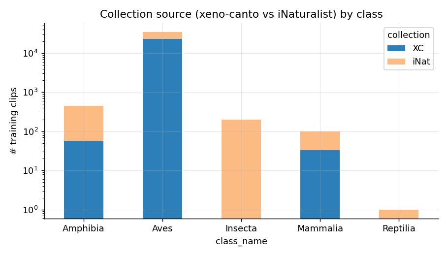

### 1.5 Recording quality (`rating`)

iNaturalist clips are all 0 (no rating system). For XC, ratings cluster at 0,
3.5, and 4.5. Heads-up: `rating > 0` filter would discard all 12,506 iNat clips
including most non-bird classes.

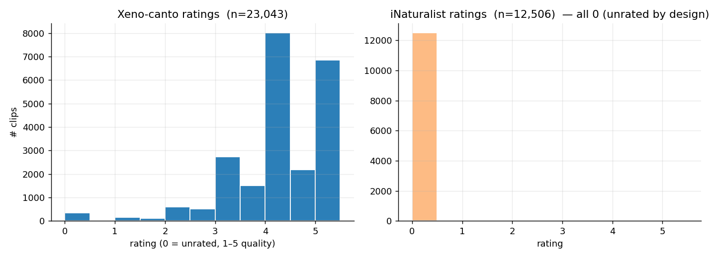

---

## 2. Geography — the domain-shift problem

100% of `train.csv` rows have lat/lon. Plotting them reveals training data is
**global** — mostly Americas + Europe + Africa + Asia. The Pantanal bounding
box (red) holds **only 847 clips (2.38%)**.

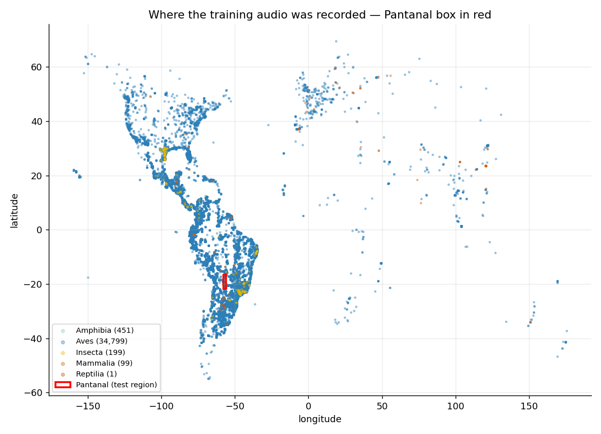
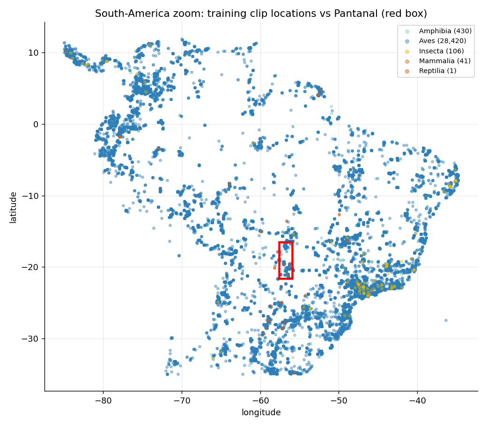

> Implication: out-of-distribution test data. Per-species training audio comes
> from populations far from Pantanal — accents/dialects matter. Domain
> adaptation, geographic upweighting, pseudo-labels on the unlabeled
> `train_soundscapes`, or models tolerant to environmental shift are all
> material levers.

---

## 3. Audio properties

Sampled 1,364 `train_audio` files across all 206 species directories. Real
durations probed via `soundfile.info()`.

| metric          | value          |
| :-------------- | :------------- |
| median          | **21.4 s**     |
| mean            | 35.2 s         |
| min / max       | 0.009 s / 734 s |
| p99             | 249 s          |
| sample rate     | **32 kHz** (100% of sample) |
| channels        | **mono** (100% of sample) |

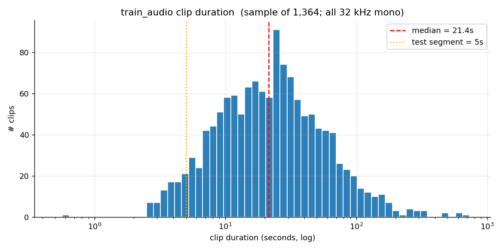

> Some clips are <1 s (effectively unusable as a 5-s window). A meaningful
> chunk are >4 min (must subsample). Standard practice: take first 5–10 s,
> or extract energy/event windows.

`train_soundscapes` files spot-checked: **all 60.0 s** mono 32 kHz. So each
yields exactly 12 five-second prediction windows.

---

## 4. `train_soundscapes/` — the field recordings

10,658 files across **23 sites** (S01–S23), spanning **2014-01-07 → 2025-11-29**.
Site coverage is wildly unbalanced — four sites (S22, S02, S01, S13)
account for ~95% of files.

| top sites | files |
| :- | -: |
| S22 | 3,383 |
| S02 | 2,505 |
| S01 | 2,341 |
| S13 | 1,873 |
| S19 |    76 |
| (… 18 others, all < 100) | |

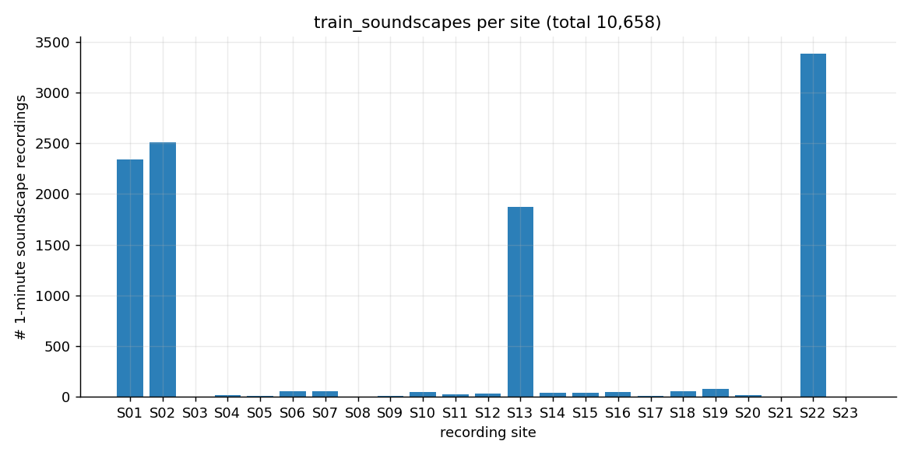
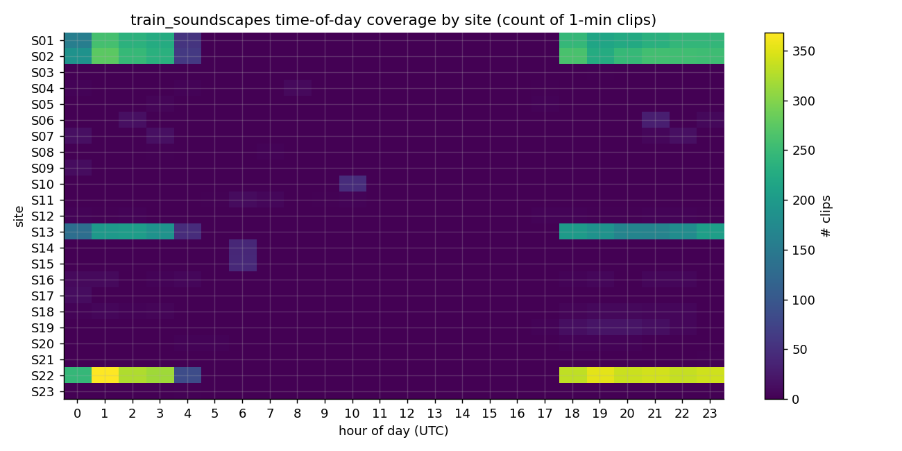
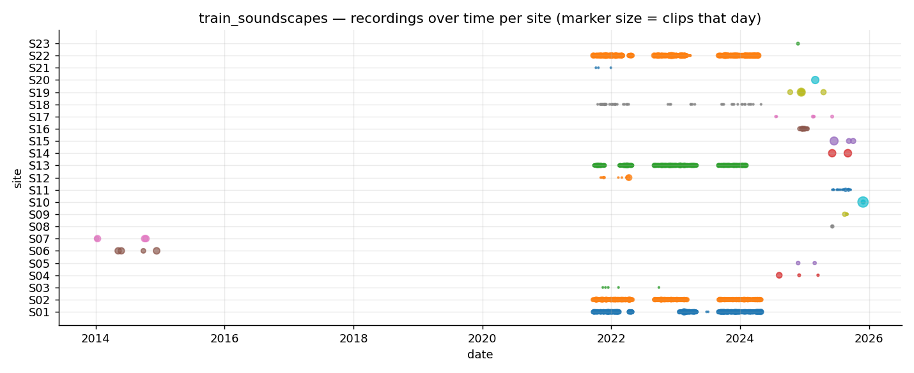

> Time-of-day plot shows nocturnal-heavy coverage in some sites — useful for
> hour-conditioned augmentation/priors. Long temporal coverage (11 yrs) means
> seasonal effects available if exploited.

---

## 5. `train_soundscapes_labels.csv` — the labeled soundscape subset

### 5.1 Critical data quirk: duplicates

```
raw rows: 1,478
unique:     739    (50% duplicates — every row appears exactly twice)
```

**Dedupe before any analysis or training.** Without this, weighting will be
silently doubled for every soundscape-labeled segment.

### 5.2 Coverage

- **66 labeled soundscape files** (= 0.62% of train_soundscapes)
- Median **12 segments per file** (i.e. fully labeled 60-s file → 12 × 5-s)
- Min 2 segments / max 12 → most files are fully labeled
- **75 unique species** mentioned across labels (28 of which are absent from `train_audio`)

### 5.3 Multi-label nature

| stat | value |
| :- | -: |
| mean species per segment | **4.22** |
| max species in one segment | **10** |
| % segments multi-label | **89.4%** |

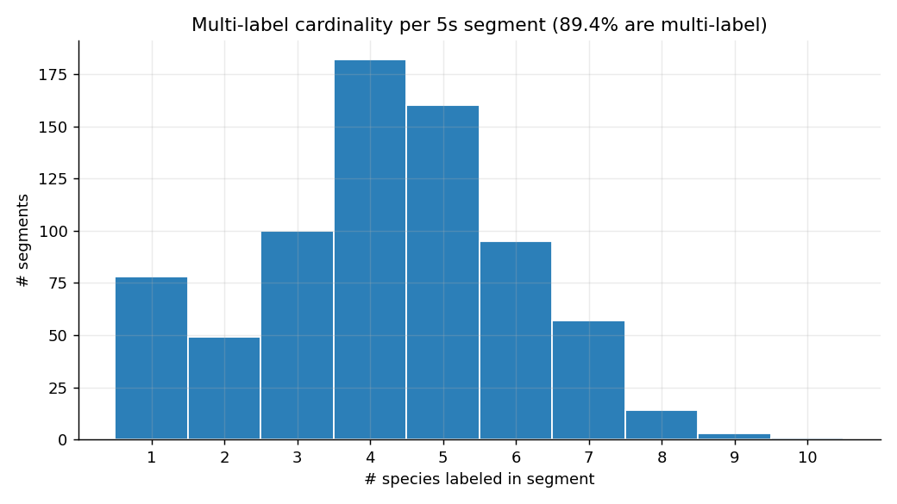
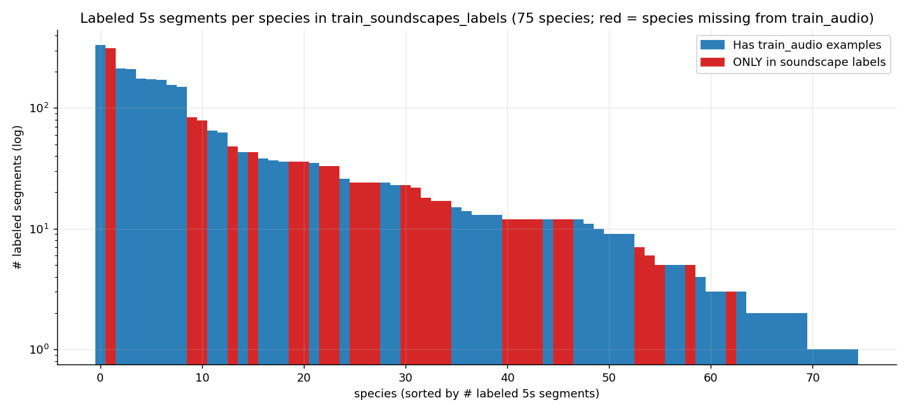
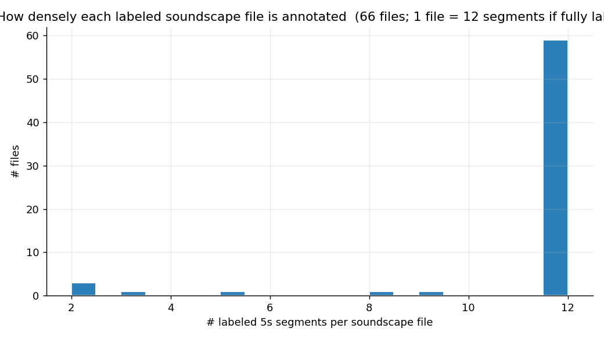

> Treat soundscape head as multi-label sigmoid (not softmax). Many segments
> contain large concurrent choruses (insect sonotypes especially co-occur).

---

## 6. Submission format sanity check

- 234 species columns — **exact match** with `taxonomy.csv`'s `primary_label`
  set. No missing/extra columns.
- `row_id` format: `[soundscape_filename]_[end_time_seconds]`
- Sample values are uniform `1/234 ≈ 0.00427` baseline.

---

## 7. Online research (no training-data assumptions)

Independent context from public Kaggle write-ups and discussion. Sources at end.

### Recurring techniques in BirdCLEF 2024/2025 top solutions

1. **Mel-spectrogram + CNN ensembles, dominantly EfficientNet (B0/B3/V2-S/V2-B3)**
   — used by 1st, 2nd, 5th place (BirdCLEF 2025).
2. **Iterative noisy-student / pseudo-labeling.** Train on labeled subset →
   predict on unlabeled soundscapes → retrain on both, possibly several rounds.
   BirdCLEF 2025 1st place: 10 teacher models → pseudo-labels →
   two-stage self-distillation on 50% labeled + 50% pseudo.
3. **SED (Sound Event Detection) heads.** Frame-level attention instead of
   clip-level pooling; lets the model produce per-frame predictions and feeds
   the 5-s windowing of test cleanly.
4. **External data.** External xeno-canto and iNaturalist data added for rare
   classes (BirdCLEF 2025 1st place added ~5.5k birds + ~17k insects/amphibians
   for "other" classes).
5. **Loss design for AUC.** BirdCLEF 2025 1st place optimized **SoftAUCLoss**
   (pairwise) directly because the metric is macro-ROC-AUC; others used
   focal-BCE or sigmoid + BCE. CPU-only inference makes lightweight models
   (EfficientNet-B0/V2-S) attractive.
6. **Class balancing.** Upsample classes with < 20–30 samples; for very rare
   classes, listen-to-all and manually trim noise/silence.
7. **Voice removal.** Run Silero VAD (or similar) to mask human speech in
   training clips (xeno-canto recordings often contain narration).
8. **Augmentations.** Mixup/CutMix on spectrograms, SpecAugment, random gain,
   pitch/time shift, background noise blending from train_soundscapes.
9. **Inference engineering.** Submission runs on **CPU only**, ≤90 min for
   ~600 test files. ONNX export, INT8 quantization, and TTA budgets all matter.

### What's new / specific to BirdCLEF+ 2026

- **Pantanal region.** Different acoustic environment from past years
  (Colombia 2025, Hawaii 2024, Western Ghats 2023, Colombia 2022, US 2021).
- **Wider taxonomic mix.** Insects/amphibians/mammals/reptiles, not just
  birds, and crucially insect *sonotypes* without species identity.
- **`train_soundscapes_labels.csv` is small but multi-label.** Unlike some
  past years where labeled soundscape data was unavailable.
- **GPU submissions effectively disabled** (1-min runtime cap) → CPU
  inference is mandatory this year.

---

## 8. Recommended next steps

1. **Dedupe `train_soundscapes_labels.csv` immediately**, before any training.
2. **Two-headed training:**
   - clip-level model on `train_audio` (single-label or weighted multi-label
     with `secondary_labels`), windowed to 5-s segments
   - soundscape-level model on dedup'd `train_soundscapes_labels.csv`
     (multi-label, 89% of segments)
3. **Pseudo-label the remaining 10,592 unlabeled soundscape files** with an
   ensemble of teachers; iterate (noisy-student style).
4. **Address class imbalance**: oversample non-Aves classes ≥10×; consider
   a dedicated "insect sonotype" branch since those 25 classes only appear
   in soundscapes.
5. **Stress-test domain shift**: hold out the 847 Pantanal-box clips as a
   pseudo-test set during development.
6. **CPU inference budget**: prototype with EfficientNet-B0/V2-S → ONNX
   → benchmark ≤90 min on Kaggle's CPU notebook before submission day.

---

## Sources (online research)

- [BirdCLEF+ 2025 — 1st place: Multi-Iterative Noisy Student (Nikita Babych)](https://www.kaggle.com/competitions/birdclef-2025/writeups/nikita-babych-1st-place-solution-multi-iterative-n)
- [BirdCLEF+ 2025 — 2nd place GitHub (Vialactea / Sydorskyy)](https://github.com/VSydorskyy/BirdCLEF_2025_2nd_place)
- [BirdCLEF+ 2025 — 5th place GitHub (myso1987)](https://github.com/myso1987/BirdCLEF-2025-5th-place-solution)
- [BirdCLEF+ 2025 — 13th place writeup](https://www.kaggle.com/competitions/birdclef-2025/writeups/h-k-z-13rd-solution-for-birdclef-2025)
- [BirdCLEF+ 2025 — 29th place discussion](https://www.kaggle.com/c/birdclef-2025/discussion/583387)
- [Top-2% retrospective — Max Melichov (Medium)](https://medium.com/@maxme006/how-i-climbed-to-the-top-2-in-birdclef-2025-every-failure-every-lesson-and-why-details-matter-273d781a33df)
- [BirdCLEF+ 2025 top-5 teams overview](https://tekkix.com/articles/ai/2025/07/birdclef-2025-overview-of-the-competition-a)
- [BirdCLEF+ 2026 — EDA discussion thread](https://www.kaggle.com/competitions/birdclef-2026/discussion/681827)
- [BirdCLEF+ 2026 — strategy playbook PDF (Dauphine)](https://www.lamsade.dauphine.fr/~ebenhamou/Becoming_a_Kaggle_Master/static/slides/Birdclef_2026.pdf)
- [BirdCLEF 2026 official LifeCLEF page](https://www.imageclef.org/BirdCLEF2026)
- [Distilling spectrograms into tokens — BirdCLEF+ 2025 paper](https://arxiv.org/html/2507.08236)
- [Tackling Domain Shift in Bird Audio Classification (CEUR)](https://ceur-ws.org/Vol-4038/paper_256.pdf)
- [Transfer Learning with Pseudo Multi-Label Birdcall Classification — DS@GT BirdCLEF 2024](https://arxiv.org/html/2407.06291v1)
- [BirdCLEF 2023 — 4th place GitHub (Fujita)](https://github.com/AtsunoriFujita/BirdCLEF-2023-Identify-bird-calls-in-soundscapes)
- [Weakly-Supervised Classification and Detection of Bird Sounds — BirdCLEF 2021](https://arxiv.org/pdf/2107.04878)
